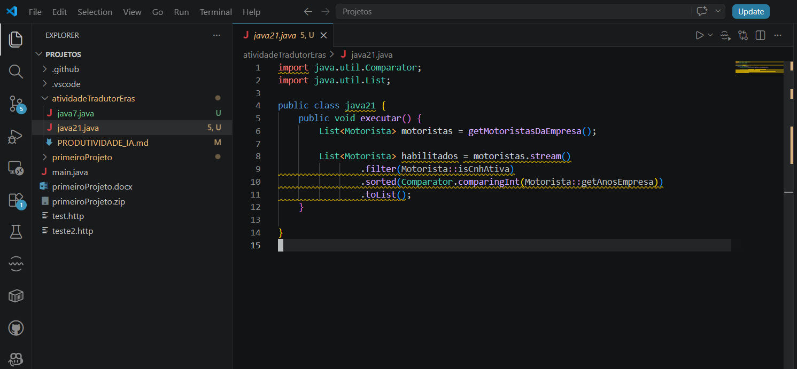

## Atividade Prática: Potencializando sua Produtividade Java com IA

### Código atualizado Java 21

```
import java.util.Comparator;
import java.util.List;

public class java21 {
    public void executar() {
        List<Motorista> motoristas = getMotoristasDaEmpresa();

        List<Motorista> habilitados = motoristas.stream()
                .filter(Motorista::isCnhAtiva)
                .sorted(Comparator.comparingInt(Motorista::getAnosEmpresa))
                .toList();
    }

}
```

### Insights da IA da mudança

Os motivos para as alterações que foram feitas de Java 7 para Java 21 se deve dos seguintes pontos: O principal foi substituir algo "manual" para simplesmente se preocupar com a filtragem da regra de negócio, assim se preocupando apenas com o que quer ser feito e deixando o como para o programa de fundo cuidar. Isso mantém código mais limpo, mais claro, entendível e até mais seguro já que da forma que foi feita a lista "habilitados" não pode ser editada depois. Vale ressaltar que depende do caso, há casos que vale mais a pena manter o "for-each", mas nesse caso de "Transformação sucessiva" faz sentido.
Uma analogia interessante: As modificações feitas, como eu disse, focam mais no "o que deve fazer" ao invés de "como fazer" e isso gera um paralelo com o que ocorre hoje ao se progrmar junto de IAs.

### Desafio para a IA

Prompt: "Agora, explique-me: se eu quisesse que esse filtro também removesse motoristas que não possuem um Optional de seguro ativo, como eu alteraria essa Stream? Não me dê o código, explique-me a lógica."

Resposta: A solução sugerida seria adicionar uma nova validação na etapa de filtragem. A lógica seria fazer a seguinte filtragem a mais:

```
H Ativa? -> Possuí seguro? -> Seguro está ativo?
```

Para o Optional, antes de validar se o seguro está ativo, é validado se há um seguro para começo de conversa, assim caso não haja um seguro não é preciso ir para a etapa de validar se o seguro está ativo e os motoristas que não possuem seguro já não são adicionados na lista. Isso dá mais segurança ao código e cobre o caso de que nem todo motorista tem seguro.

### Captura de tela


